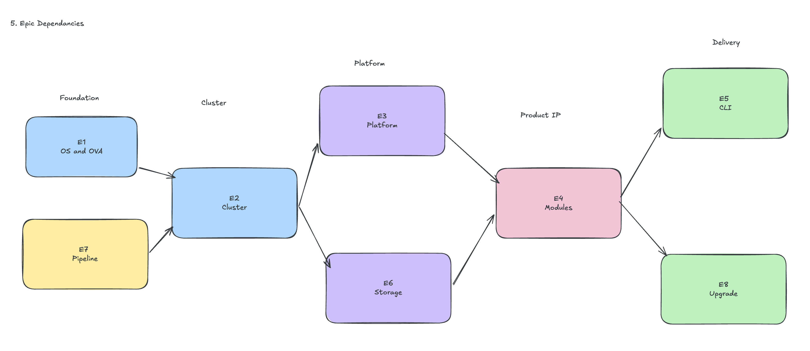

# Deliverable 3 — Jira epic structure

## Epic overview

Eight epics decompose the work. Each is described with its goal and definition of done, followed by representative key stories. Cross-epic dependencies follow the epic summaries.

---

### E1 — Host OS and VM delivery

**Goal:** A deployable OVA that boots to a fully configured working state on first power-on with zero operator intervention, on VMware and other OVF-capable hypervisors.

**Definition of done:** OVA imports and boots on vCenter and at least one non-VMware OVF hypervisor; all OVF properties are consumed correctly; system reaches healthy state (RKE2 up, all platform pods Running, `arkctl` responding) within 10 minutes; no operator login at any point.

**Key stories:**
- Configure openSUSE MicroOS base with transactional-update and correct Btrfs subvolume layout
- Implement cloud-init datasource integration (VMware GuestInfo + generic OVF fallback)
- Build bootstrap agent as one-shot idempotent systemd service
- Define and validate OVF property schema (network, credentials, optional VIP, optional NTP)
- Configure Zot registry as persistent startup service with pre-load capability
- Build OVA packaging automation in Bitbucket Pipelines
- Enforce PVC mount path exclusion from Btrfs snapshot boundary
- First-boot integration test suite (air-gapped environment, no DNS, no internet)

---

### E2 — Cluster lifecycle

**Goal:** Single-node and multi-node RKE2 clusters that form reliably from the OVA via OVF parameters, with correct topology enforcement.

**Definition of done:** Single-node cluster forms on first boot; 3-node HA cluster forms via OVF join parameters without shell access; 2-node topology blocked at CLI; HA cluster survives a control-plane node failure with VIP transferring within 30 seconds.

**Key stories:**
- Deploy RKE2 server with CIS hardening defaults and encrypted Secrets at rest
- Deploy kube-vip as static pod in ARP/Layer-2 mode with Kubernetes lease election
- Implement multi-node join via OVF `role` and `join-endpoint` parameters
- Enforce topology rules: 1 or 3+ control-plane nodes; actively block 2-node topology
- Configure etcd snapshotting and retention
- HA failover test: kill control-plane node, measure VIP transfer time, verify traffic resumes

---

### E3 — Platform services

**Goal:** A complete set of shared platform services — ingress, TLS with IP SAN, identity — that every module relies on without re-implementing.

**Definition of done:** Ingress routes HTTPS traffic to a test backend on a single IP with no hostname; cert-manager certificate carries a correct IP SAN; local admin/operator accounts created from OVF credentials at bootstrap; optional LDAP/AD/OIDC federation configurable and tested; default-deny NetworkPolicy baseline applied.

**Key stories:**
- Deploy cert-manager with self-signed internal CA (separate from RKE2's internal cluster PKI)
- Implement IP SAN certificate issuance from OVF VIP parameter
- Deploy ingress-nginx bound to platform VIP
- Implement local identity service (account management, credential hashing)
- Implement optional LDAP/AD/OIDC federation (additive, fails safely to local accounts)
- Apply platform-level NetworkPolicy baseline
- TLS validation test: IP SAN verification, cert rotation, expiry handling

---

### E4 — Module lifecycle system

**Goal:** A module operator and SupernaModule CRD that owns the full install/upgrade/remove/health lifecycle for any module conforming to the `module.yaml` contract.

**Definition of done:** A reference module installs, upgrades, and removes via `arkctl` with no direct Kubernetes operations; resource governance, network isolation, and dependency enforcement applied automatically; CR status is accurate throughout the lifecycle; reference module conformance suite passes.

**Key stories:**
- Define SupernaModule CRD schema (versioned, with status subresource and condition types)
- Write and publish `module.yaml` manifest specification
- Implement operator reconciliation loop (install, upgrade, remove, health state machine)
- Implement dependency resolution (refuse install if declared dependencies missing at required version)
- Implement ResourceQuota and LimitRange provisioning per namespace from manifest declarations
- Implement default-deny NetworkPolicy with platform allow rules and inter-module dependency rules
- Implement PVC provisioning from storage declarations in manifest
- Implement Helm install/upgrade/rollback via operator (idempotent, resume-safe)
- Build reference module conformance test suite
- Operator fault-tolerance tests (restart mid-install, duplicate installs, idempotent re-run)

---

### E5 — ARK CLI (`arkctl`)

**Goal:** A single CLI giving operators full day-2 control of the platform without requiring Kubernetes literacy.

**Definition of done:** All FR8 operations achievable via `arkctl` with no `kubectl` required; `diagnose` bundle complete and redacted by default; all commands documented with `--help`.

**Key stories:**
- CLI framework and kubeconfig authentication
- `module` subcommands: install, remove, upgrade, list, status
- `cluster` subcommands: status, node add, node drain, token
- `upgrade` subcommands: apply, rollback, verify
- `diagnose`: log/event/state collection, credential redaction, `--include-sensitive` flag
- `identity` subcommands: configure federation, status
- Man-page and `--help` coverage for all commands

*Note: Engineer C owns the `arkctl diagnose` command end-to-end as a stretch assignment (see Deliverable 5).*

---

### E6 — Storage layer

**Goal:** PVC provisioning for single-node (local-path) and multi-node (Longhorn) deployments, plus NFS CSI for customer NAS integration, with a tested migration path between the two.

**Definition of done:** Modules receive PVCs in both deployment shapes; Longhorn volumes survive a node failure and reconstruct; local-path → Longhorn migration completes with no data loss verified; NFS CSI mounts a customer NAS endpoint correctly.

**Key stories:**
- Deploy Longhorn for multi-node PVC provisioning with configurable replica count
- Deploy local-path provisioner for single-node
- Storage class selection logic (node count drives storage class selection)
- Implement `arkctl storage migrate` (local-path → Longhorn, data integrity verification)
- Deploy NFS CSI driver
- Storage resilience test (node failure → Longhorn reconstruction, I/O verified during reconstruction)
- Migration test (write known payload, migrate, verify payload intact)

---

### E7 — Build and release pipeline

**Goal:** A fully automated Bitbucket Pipelines pipeline that produces signed, scanned, SBOM-attached OVA and upgrade bundle artifacts ready for customer distribution.

**Definition of done:** Merge to main triggers build; OVA and bundle produced, Snyk and Xray scanned, cosign signed, syft SBOM attached, pushed to Artifactory Staging; promotion to release requires manual approval; pipeline fails hard on scan findings above severity threshold.

**Key stories:**
- Self-hosted runner setup (sizing, network isolation, secrets via Infisical)
- OVA build automation (OS image construction, Zot pre-load, OVF packaging)
- Image reference rewrite step (all chart values rewritten to local Zot path at build time)
- Upgrade bundle packing (self-extracting format, manifest generation, checksum generation)
- Snyk integration (SAST/SCA/IaC with build-blocking thresholds)
- JFrog Xray integration (automated scan on artifact push to Artifactory)
- cosign signing with key managed in Infisical
- syft SBOM generation and attachment
- Artifactory staging → release promotion workflow with manual gate
- CVE-triggered rebuild automation (Xray alert → pipeline trigger)

---

### E8 — Upgrade system

**Goal:** An in-place upgrade system that applies upgrade bundles idempotently, checkpoints progress for safe resume, and rolls back automatically when post-upgrade verification fails.

**Definition of done:** Upgrade completes N → N+1 without data loss; interrupted upgrade resumes from last checkpoint; failed post-upgrade verification triggers automatic rollback; min-required-version enforced; PVC data unchanged after OS-level rollback.

**Key stories:**
- Bundle signature verification (hard block if invalid — no partial extraction)
- Bundle manifest parsing and min-required-version enforcement
- Upgrade orchestrator with checkpoint state file
- Checkpoint 1: `transactional-update` OS snapshot staging
- Checkpoint 2: Platform Helm upgrade sequencing (dependency order)
- Checkpoint 3: Module upgrade sequencing (declared dependency order)
- Checkpoint 4: OS activation — reboot into new snapshot
- Post-boot verification (all platform components and modules healthy)
- Rollback: Helm rollback (reverse dependency order) + boot previous Btrfs snapshot
- Resume tests: interrupt at each checkpoint, verify correct resume without data loss
- Rollback test: inject failure at verification step, verify rollback and data integrity

---

## Cross-epic dependencies

**Hard blockers (nothing starts until the blocker is done):**

| Epic | Blocked by | Reason |
|------|-----------|--------|
| E2 — Cluster | E1 | Needs a bootable OVA to test cluster formation |
| E3 — Platform | E2 | Needs a running cluster to deploy platform services |
| E6 — Storage | E2 | Needs a running cluster |
| E4 — Modules | E3 | Module operator depends on registry, ingress, and identity all running |
| E5 — CLI | E4 | CLI commands interact with the SupernaModule CRD |
| E8 — Upgrade | E4, E3 | Upgrade sequencing requires both platform and module lifecycle to be stable |

**Soft dependencies (can start in parallel with caveats):**

E7 (build pipeline) can start in parallel with E1 since the OVA format and packaging toolchain can be developed while the OS image is still being hardened — but E7 needs E1 to be substantially stable before the first production OVA build runs.

E3 and E6 are fully parallel once E2 is complete — neither depends on the other.

---

## Detailed acceptance criteria

### E1 — Host OS and VM delivery

**AC-1.1:** OVA imports into VMware vCenter using the standard OVF import wizard. All declared vApp properties appear in the vApp Options UI before power-on. No manual VM configuration required after import.

**AC-1.2:** The same OVA boots correctly on at least one non-VMware OVF-capable hypervisor (test target: KVM with `virt-install` and `ovf-env.xml` on a virtual CD-ROM). cloud-init reads all properties correctly without modification to the OVF file.

**AC-1.3:** From power-on, the system reaches a verifiably healthy state (RKE2 reporting all nodes Ready, all platform pods Running, `arkctl cluster status` green) within 10 minutes. Test runs in a fully network-isolated environment: no internet, no DNS, no NTP (unless supplied via OVF property), no human at any console.

**AC-1.4:** The bootstrap agent runs exactly once. Re-executing the bootstrap agent systemd unit on an already-initialised system exits with code 0 and produces no change to cluster state, RKE2 configuration, or Zot registry.

**AC-1.5:** The Btrfs filesystem is configured with a root subvolume for the OS and a separate named subvolume for persistent data (PVC mount paths). The persistent data subvolume is not included in any transactional-update snapshot. Verified by inspecting `btrfs subvolume list` and `snapper list` on a post-boot system.

**AC-1.6:** A test writes a known payload to a PVC-backed path. The OS is then rolled back to the previous Btrfs snapshot. After rollback, the PVC-backed path still contains the original payload unchanged. This is the single most important acceptance criterion in the epic — it is the structural proof of the FR5 data-safety claim.

**AC-1.7:** All image pulls during bootstrap go to the local Zot registry. A network capture confirms zero requests to any external registry. Removing internet access must not change the bootstrap outcome.

**AC-1.8:** If any required OVF property is absent or malformed, the bootstrap agent logs a clear, human-readable error identifying the missing field and exits without starting RKE2. Result: a powered-on VM with a diagnostic log and no partial cluster state.

**AC-1.9:** OVA file size is measured in the pipeline and the build fails if it exceeds the agreed threshold (exact value = OQ-3 in risk register; informed by customer distribution constraints).

---

### E4 — Module lifecycle system

**AC-4.1:** A module bundle with a valid, signed `module.yaml` installs successfully via `arkctl module install <bundle>`. No direct `kubectl` or Helm access during the test. Module reaches Running state and its health endpoint returns healthy.

**AC-4.2:** If `module.yaml` declares a dependency on Module B at version ≥1.2.0 and Module B is absent, the install command exits with a clear dependency error before creating any Kubernetes resource. `kubectl get all -n <module-namespace>` after failure returns empty — no partial state.

**AC-4.3:** If `module.yaml` declares a dependency on Module B at version ≥1.2.0 and Module B is installed at version 1.1.0, the same result as AC-4.2 applies. Version comparison uses semver semantics, not lexicographic comparison.

**AC-4.4:** The module's namespace contains a ResourceQuota and LimitRange whose values match the resource declarations in `module.yaml` exactly, and these objects exist before any pod starts. A module pod attempting to exceed its declared limits fails scheduling with a clear quota-exceeded event visible in `arkctl module status`.

**AC-4.5:** A pod in Module A's namespace cannot reach a pod in Module B's namespace by direct IP unless Module A's `module.yaml` declares Module B as a dependency. Verified by direct IP connectivity test before and after adding the dependency declaration.

**AC-4.6:** All module pods can reach CoreDNS, the platform ingress controller, Zot registry, cert-manager, and identity service endpoints via platform allow-rules generated automatically by the operator. No operator configuration required.

**AC-4.7:** `arkctl module remove <name>` removes all Helm release resources, the module namespace, and all PVCs/PVs. `kubectl get ns <module-namespace>` returns NotFound. With `--retain-data`, PVCs and backing PVs are preserved; everything else is removed.

**AC-4.8:** SupernaModule CR `.status.phase` transitions correctly through `Pending → Provisioning → Installing → Running` during a normal install. An operator polling `arkctl module status` at any point sees the correct current phase. The phase never skips directly from `Pending` to `Running`.

**AC-4.9:** If the module operator pod is killed and restarted at any point during an install, the reconciliation loop resumes without re-provisioning already-created resources. Namespace, PVCs, and NetworkPolicy objects already in place are not recreated; idempotent reconciliation is verified at each stage.

**AC-4.10:** A module declaring `clusterScopedPermissions: true` in `module.yaml` triggers an explicit operator confirmation prompt during `arkctl module install`. No cluster-scoped RBAC is granted silently.

**AC-4.11:** The reference module conformance test suite (exercising install, upgrade, remove, dependency enforcement, resource limit enforcement, network isolation) passes against the module operator without modification to operator code. This suite is the acceptance gate, not a supplemental test.
